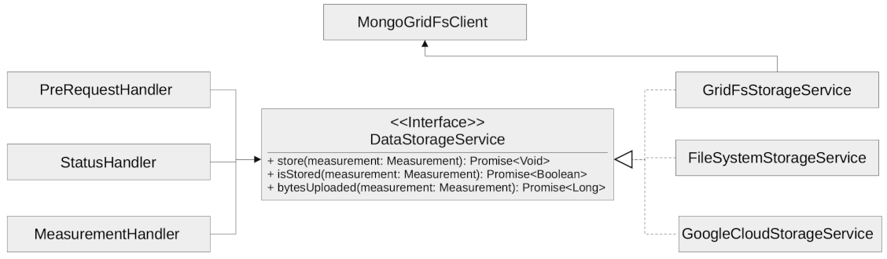

# Collector


This application represents the [Cyface](https://cyface.de) data collector software.

It is used to collect traffic data from Cyface measurement devices, such as our sensor box or our smartphone application.

Our smartphone SDK is available as GPL application for [Android](https://github.com/cyface-de/android-backend) and [iOS](https://github.com/cyface-de/ios-backend) (or as [Podspec](https://github.com/cyface-de/ios-podspecs)) as well.

If you require this software under a closed source license for you own projects, please [contact us](https://www.cyface.de/#kontakt).

Changes between versions are found in the [Release Section](https://github.com/cyface-de/data-collector/releases).

The project uses [Gradle](https://gradle.org/) as the build system.

## Overview

* [Collector](#Collector)

.General information
* [Release a new Version](#release-a-new-version)
* [Publishing Artifacts to GitHub Packages manually](#publishing-artifacts-to-github-packages-manually)
* [To Do](#to-do)
* [Licensing](#licensing)

## Collector

A program which provides the ability to collect data, as e.g. sent by the Cyface SDKs.

The following sections start with an explanation on how to set up all the required certificates.
This is a necessary prerequisite for all the following steps.
So **DO NOT** skip it.

### Certificates
The Cyface Data Collector provides keys you may use for testing and during development.
Those keys are located in `src/test/resources`.
To use them outside of Unit tests you need to copy them to an appropriate location.
**ATTENTION: DO NOT USE THOSE KEYS IN A PRODUCTION ENVIRONMENT.**
Since they are in our repository, they are openly available to everyone on the internet, so everyone can compromise security on your server if you use the default keys.

The Cyface Data Collector requires two keys to issue and authenticate JWT tokens for users trying to communicate with the service.
Just place the appropriate files as `private_key.pem` and `public.pem` in `secrets/jwt`, right next to the `docker-compose.yml` file, or in the "working directory" selected in your run configuration in your IDE (e.g. `data-collector/`).

To generate new keys follow the instructions in the [Vert.x documentation](https://vertx.io/docs/vertx-auth-jwt/java/#_loading_keys) for *Using RSA keys*.

### Building

To build the docker container running the API simply execute `./gradlew :clean :build :copyToDockerBuildFolder`.
This builds the jar file which is then packed into the Docker container which is build afterwards.
Please refer to the previous section about **Certificates** prior to building.

When you updated the Swagger UI make sure to clear your browser cache or else it might not update.

### Execution
This section describes how to execute the Cyface Data Collector.

It begins with an explanation on how to run the Cyface Data Collector from a Docker environment.
This is the recommended variant if you do not need to change the collector itself, but only need to develop against its API.

The section continues with an explanation on the supported configuration parameters.
If you are not using the Docker environment, you will probably have to set a few of them to the correct values, before running the Cyface Data Collector.

The last two sections provide explanations on how to run the software directly from the terminal or from within an IDE such as Eclipse or IntelliJ.
For these execution variants you need the parameters explained in the preceding section.

#### Running from Docker

Make sure you read the "Certificates" section above. For development environment you can use the test certificates: `mkdir -p src/main/docker/secrets/jwt && cp src/test/resources/public.pem src/main/docker/secrets/ && cp src/test/resources/private_key.pem src/main/docker/secrets/`

Configure logback or use the sample configuration: `cp src/main/docker/logback.xml.template src/main/docker/logback.xml`

The app is executed by a non-privileged user inside the Docker container. To allow this user to
write data to `logs` and `file-uploads` you need to create two folders and then set the permissions for both folders to `chmod o+w`, see [DAT-797]:
`mkdir src/main/docker/logs src/main/docker/file-uploads && sudo chmod  o+w src/main/docker/file-uploads src/main/docker/logs`

Finally, make the secrets accessible by the non-privileged user:
- `sudo chown -R 9999:root src/main/docker/secrets/jwt`

Now build the system as described in the "Building" section above:
`./gradlew :clean :build :copyToDockerBuildFolder`

Then simply run `docker-compose up` inside `build/docker`:
`cd build/docker/ && docker-compose up -d`

This calls docker to bring up a Mongo-database container and a container running the Cyface data collector API. The Collector API is by default available via port 8080. This means if you boot up everything using the default settings, the Collector API is accessible via `http://localhost:8080/api/v3/`.

**ATTENTION: The docker setup should only be used for development purposes.**
It exposes the Cyface data collector as well as the ports of both Mongo database instances freely on the local network.

Use `docker-compose ps` to see which ports are mapped to which by Docker.
For using such a setup in production, you may create your own Docker setup, based on our development one.

#### Running without Docker
Running the Cyface data collector without Docker, like for example from the terminal or from within your IDE is a little more complex.
It requires a few set up steps and command knowledge as explained in the following paragraphs.

##### Running a Mongo Database for Data and User Storage
Before you can run the Cyface data collector you need to set up a Mongo database.

If you use the Docker environment as explained above, this is done for you.
If you run the Cyface data collector on your own, you are responsible for providing a valid environment, including Mongo.

The database is used to store the collected data and information about valid user accounts.
For information on how to install and run a Mongo database on your machine please follow the [tutorial](https://docs.mongodb.com/manual/installation/#mongodb-community-edition).
If you take the default installation, the default settings of the Cyface data collector should be sufficient to connect to that instance.
**ATTENTION: However be aware this is not recommended as a production environment.**

#### Data Collector Arguments
The Cyface data collector supports a few parameters to fine tune the runtime.
All of these parameters also provide reasonable defaults for a quick setup.
The parameters are provided using the typical [Vertx `-conf` parameter](https://vertx.io/docs/vertx-core/java/#_the_vertx_command_line) with a value in JSON notation.

The following parameters are supported:

* **jwt.private:** The path of the file containing the private key used to sign JWT keys. This defaults to `secrets/private_key.pem`, **which you should never use in production**.
* **jwt.public:** The path of the file containing the public key used to sign JWT keys. This defaults to `secrets/public.pem`, **which you should never use in production**.
* **http.port:** The port the API  is available at. This defaults to `8080`.
* **http.host:** The hostname under which the Cyface Data Collector is running. This can be something like `localhost`.
* **http.endpoint.v3:** The path to the endpoint the Cyface Data Collector is running. This can be something like `/api/v3`.
* **http.endpoint.v2:** The path to the endpoint the Cyface Data Collector is running. This can be something like `/api/v2`.
* **http.port.management:** The port the management API is available at. This defaults to `13371`.
* **mongo.db:** Settings for a Mongo database storing information about all the users capable of logging into the system and all data uploaded via the Cyface data collector. This defaults to a Mongo database available at `mongodb://127.0.0.1:27017`. The value of this should be a JSON object configured as described [here](https://vertx.io/docs/vertx-mongo-client/java/#_configuring_the_client).
* **admin.user:** The username of a default administration account which is created if it does not exist upon start up. This defaults to `admin`. **You must change this in a production environment**.
* **admin.password:** The password for the default administration account. This defaults to `secret`. **You must change this in a production environment**.
* **salt.path:** The path to a salt file used to encrypt passwords stored in the user database even stronger. This defaults to `secrets/salt`. If the file does not exist a default salt is used. **You should not do this in a production environment**.
* **metrics.enabled:** Set to either `true` or `false`. If `true` the collector API publishes metrics using micrometer. These metrics are accessible by a [Prometheus](https://prometheus.io/) server (Which you need to set up yourself) at port `8081`.

#### Running from Command Line

To launch your tests:

```
./gradlew clean test
```

To package your application:

```
./gradlew clean assemble
```

To run your application:

```
./gradlew run --args="run de.cyface.collector.verticle.MainVerticle -conf conf.json"
```

#### Running from IDE
To run directly from within your IDE you need to use the `de.cyface.collector.Application` class, which is a subclass of the [Vert.x launcher](https://vertx.io/docs/vertx-core/java/#_the_vert_x_launcher). Just specify it as the main class in your launch configuration with the program argument `run de.cyface.collector.verticle.MainVerticle`.

### Mongo Database

#### Setup
The following is not strictly necessary but advised if you run in production or if you encounter strange problems related to data persistence.
Consider reading the [Mongo Database Administration Guide](https://docs.mongodb.com/manual/administration/) and follow the advice mentioned there.

#### Administration
To load files from the Mongo GridFS file storage use the [Mongofiles](https://docs.mongodb.com/manual/reference/program/mongofiles/) tool.

* Showing files: `mongofiles --port 27019 -d cyface list`
* Downloading files: `mongofiles --port 27019 -d cyface get f5823cbc-b8f5-4c80-a4b1-7bf28a3c7944`
* Unzipping files: `printf "\x78\x9c" | cat - f5823cbc-b8f5-4c80-a4b1-7bf28a3c7944 | zlib-flate -uncompress > test2`


## Release a new Version

To release a new version:

1. *Create a new release branch* following the format `release-x.y.z`.
a. `x.y.z` is the number of the new version following [Semantic Versioning](http://semver.org).
b. *Hotfixes can be branched from the already existing release-branch*
A. Merge the hotfix into the `main` and `release` branch, create pull requests and pass reviewing.
B. No new features are allowed on a release-branch, only fixes and minor changes.

2. *Increase version numbers* in root `build.gradle`,
a. and optional in any associated `docker-compose.yml` or OpenAPI documentation (usually located in `src/main/resources/webroot/openapi.yml`).
b. If you need to version sub-projects differently, create a version attribute in the corresponding `build.gradle`.

3. *Commit version bump and push branch* to GitHub.
a. Wait until the continuous integration system passes.
b. Create a Pull Request from your `release-x.y.z` branch to `release`.
c. Get the Pull Request accepted and merge it.

4. *Tag the new release on the release branch*.
a. Ensure you are on the correct branch and commit.
b. Follow the guidelines from ["Keep a Changelog"](https://keepachangelog.com) in your tag description.

5. *Push the release tag to GitHub*.
a. The docker image and GitHub packages are automatically published when a new version is tagged and pushed by our
   [GitHub Actions](https://github.com/cyface-de/data-collector/actions) to the
   [GitHub Registry](https://github.com/cyface-de/data-collector/packages).

6. *Mark the released version as 'new Release' on [GitHub](https://github.com/cyface-de/data-collector/releases)*.


## Publishing artifacts to GitHub Packages manually

The artifacts produced by this project are distributed via [GitHubPackages](https://github.com/features/packages).
Before you can publish artifacts you need to rename `gradle.properties.template` to `gradle.properties` and enter your GitHub credentials.
How to obtain these credentials is described [here](https://help.github.com/en/github/managing-packages-with-github-packages/about-github-packages#about-tokens).

To publish a new version of an artifact you need to:

1. Increase the version number of the sub-project within the `build.gradle` file
2. Call `./gradlew publish`

This will upload a new artifact to GitHub packages with the new version.
GitHub Packages will not accept to overwrite an existing version or to upload a lower version.
This project uses [semantic versioning](https://semver.org/).

## To Do
* Setup Cluster
	* Vertx
	* MongoDb

# Package de.cyface.collector.model

Contains all the data model files required by the Cyface data collector.

# Package de.cyface.collector.storage

Contains the interface to store data in Cyface and several implementations for that interface.

Those implementations provide support for storing data in GridFS, on the local file system and in Google Cloud storage.

The following image shows an overview of the interface and how it is embedded in the Cyface data collector.


## Licensing
Copyright 2018-2022 Cyface GmbH

This file is part of the Cyface Data Collector.

The Cyface Data Collector is free software: you can redistribute it and/or modify
it under the terms of the GNU General Public License as published by
the Free Software Foundation, either version 3 of the License, or
(at your option) any later version.

The Cyface Data Collector is distributed in the hope that it will be useful,
but WITHOUT ANY WARRANTY; without even the implied warranty of
MERCHANTABILITY or FITNESS FOR A PARTICULAR PURPOSE.  See the
GNU General Public License for more details.

You should have received a copy of the GNU General Public License
along with the Cyface Data Collector.  If not, see http://www.gnu.org/licenses/.
